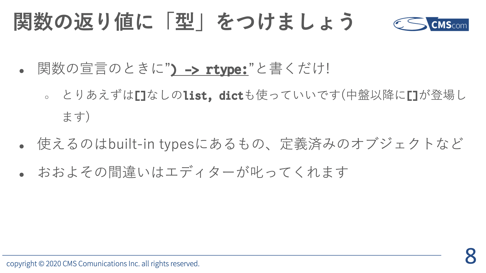
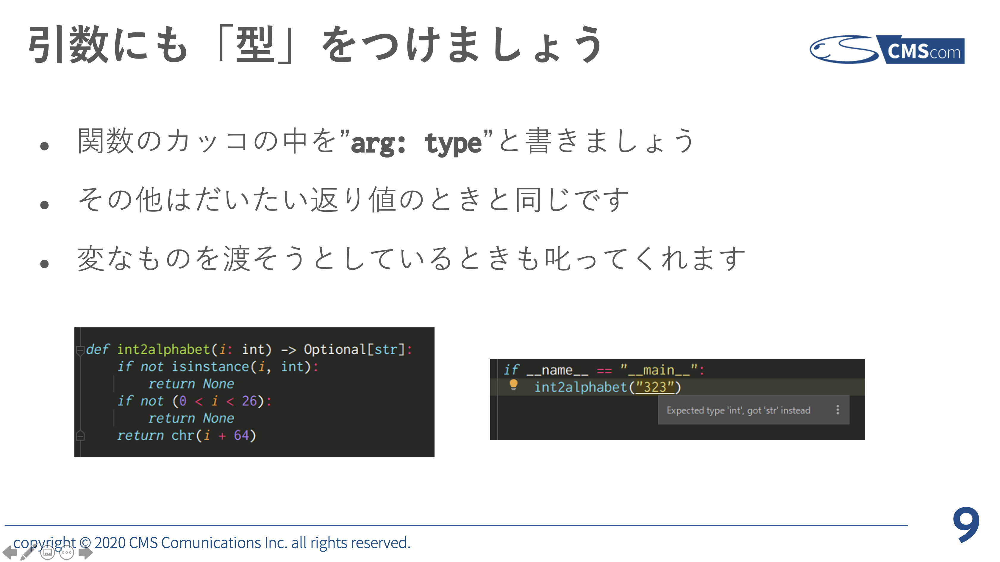
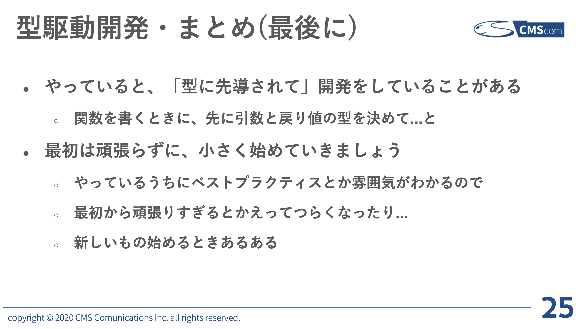

<!-- _class: title-->
<!-- _paginate: false -->


# 2021年の型駆動設計(開発)

## CMScom Techtalk 2021/05/07

---

<!-- _class: agenda -->


# Table of Contents

1. Type hint ざっくり復習
    1. 関数定義のところから書くのがおすすめ
2. Python3.10 style な type hinting
    1. 3.9, 3.10 の Type hint 系新機能を紹介
    2. Pattern Matching, str.removeprefix() とか他の機能については話さない
3. 型を意識して設計するということ

---

<!-- class: content -->

# はじめに: Type hint 書いてますか?

- 書いている → 少し飛ばして後半に議論したい
- 書いていない → 前に話したことを少し説明します

---

<!-- _class: subtitle -->
<!-- _paginate: false -->


# 2020/09/11 TechTalk で話したこと

---



---



---



---

<!-- _class: subtitle -->
<!-- _paginate: false -->


# 3.10 Style な type hinting

---

# 3.8から何が変わったか概要

次ページから1つずつ見ていきます
- [3.8 → 3.9](https://docs.python.org/3.10/whatsnew/3.10.html#new-features-related-to-type-hints)
    - 小文字始まりの標準コレクション型ヒント
- [3.9 → 3.10](https://docs.python.org/3.10/whatsnew/3.10.html#pep-604-new-type-union-operator)
    - Union 型演算子`|`
    - 引数仕様変数 (原題: Parameter Specification Variables)
    - 明示的な型エイリアス

---

# [PEP 585](https://www.python.org/dev/peps/pep-0585/): 小文字始まりの標準コレクション型ヒント

- 3.9からの新機能
- list, dict, Iterable, etc...
    - [PEP 585 のページ](https://www.python.org/dev/peps/pep-0585/#implementation)で列挙されている
- `list[str]`のように書く
- 前に話した`from typing import List`は書かなくていい
- リリースから5年後(つまり2025年)には非推奨になる
- collections 系の色々はライブラリ開発とかでもなければ普段使わなさそう
- re.Match, re.Pattern につくのは便利そう


---

# [PEP 604](https://www.python.org/dev/peps/pep-0604): Union 型演算子`|`

- 3.10の新機能
- Union の糖衣構文として`|`が使えるようになった
- `str | int == Union[str, int]`
- TypeScript とか Haskell がこの記法を使っている
- より直感的で記述量が減るのでうれしい

```python
def square(number: int | float) -> int | float:
    return number ** 2

# isinstance() でも使える
>>> isinstance(1, int | str)
True
```

---

# [PEP 612](https://www.python.org/dev/peps/pep-0612): 引数仕様変数 (原題: Parameter Specification Variables)

- 3.10の新機能
- `Callable[T, R]` の `T` に今までは tuple, Generics を渡せなかった
- str, int などの型 or elipsis (`...`) なら大丈夫だった
- 以下の例のように書けるようになる
- デコレーターを書くときに便利そう(まだ使ったことない)

```python
P = ParamSpec("P")
def validation: (f: Callable[P, str]) -> Callable[P, bool]:
    def inner(s: str) -> bool: retrun s.isascii()
```

---

# [PEP 613](https://www.python.org/dev/peps/pep-0613/): 明示的な型エイリアス

- 3.10 の新機能
- エイリアス型がエイリアスであるとより明示的になる

```python
# Before 3.10
JsonLikeDict = dict[Union[str, int], Any]

# After 3.10
JsonLikeDict: TypeAlias = dict[Union[str, int], Any]
# Union を新しい記法にしたバージョン
JsonLikeDict: TypeAlias = dict[str | int, Any]
```

---

<!-- # 3.8時代から変わってないこと

- Generator, Iterable とかはbuilt-in methodにないので変わらない

--- -->

# from \_\_future\_\_ import annotations を書く

- これらを Python3.7, 3.8 のコードで使うには`from __future__ import annotations`を書く
    - `__future__`: 今後実装予定のモジュール
    - 3.6 には非対応: [PEP 563](https://www.python.org/dev/peps/pep-0563/#enabling-the-future-behavior-in-python-3-7)
    - dunder module (?)なので一番最初に書く

```python
from __future__ import annotations
from datetime import datetime
```

---

<!-- _class: subtitle -->
<!-- _paginate: false -->


# 型を意識して設計する

## 「型駆動開発」を1年くらい実践して得た Best practices

---

# Optional をなるべく使わない

- Optionalは便利だけどコードが肥大化していく原因

```python
def get_content() -> str | None:
    r = request.get("https://example.com")
    if r.status_code != 200:  # ここがガード(早期リターン)
        logging.warning("HTTP response is %d!", r.status_code)
        return None
    return r.text
```

- ↑の関数を使うときにまたガードを書いて `None` を返すかもしれない
- 結果、先のメソッドまでガードを書く必要があり可読性が落ちる

---

- この場合なら `raise RuntimeError` なりしてしまったほうがすっきりする
    - Python は例外を発生させるコストが(比較的)低いのでパフォーマンスも大丈夫なはず
- Python に null 安全なメソッドがないのも一因だけど、あるとそれはそれで乱用してしまう
    - Null 安全とは: Null(None) を渡しても例外が発生しないメソッド
- Plone の View とかがこれで書けるかはわからないけど、内部に使っている関数レベルでならできそう


---

# Language Server の力を借りる

- Language Server(LS): エディタで補完機能などをサポートしてくれる機能
    - Pylance(VS Code extension), Jediが有名
    - 裏でプロセスが走っていて、エディタと通信して動く
- 自明な型は書かない、Language Server の推論がやってくれる
- 変数に型ヒントつける基準は推論が効かなくなる( Any 判定される)とき
- 必要があればガードをする。そうすれば取りうる型の範囲が狭まる

次ページにサンプルがあります

---

```python
i: int = random.randint(1, 5)  # `: int` は書かない

r = request.get("http://example.com/api.json")
d: dict = json.loads(r.text) if r.status_code == 200 else {}

if d == {}:  # エラー処理
    logger.error("Response is empty!")
    raise RuntimeError
pass  # ここで `d` は空dictの可能性がなくなっている
```

---

<!-- _class: agenda -->


# まとめ

- 関数定義のところから Type hint 書いていきましょう
- Python3.10 style な type hinting
    - 小文字始まりの標準コレクション型ヒント (3.9)
    - Union 型演算子`|` (3.10)
    - 引数仕様変数 (3.10)
    - 明示的な型エイリアス (3.10)
- 型を意識して設計すると全体の見通しが良くなるのでおすすめ

---

<!-- _class: epilogue -->
<!-- _paginate: false -->


# Thank you for listening!

## This slide is made by [marp](https://marp.app)
