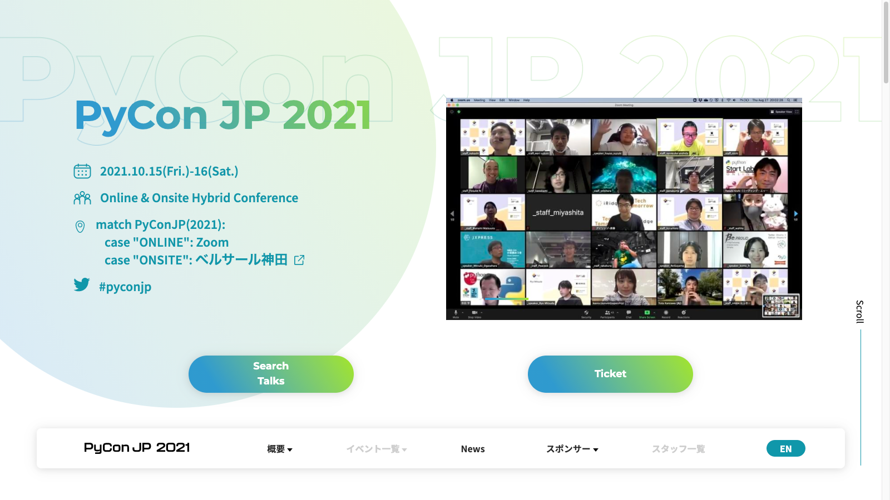

<!-- _class: title-->
<!-- _paginate: false -->

# スタッフからお知らせ :mega:

## @peacock0803sz, 2021/09/18 [`#osc21hi`](https://twitter.com/search?q=%23#osc21hi)

---

<!-- _class: preface -->

# お前、誰よ

- Peacock (Yoichi TAKAI)
    - [Twitter](https://twitter.com/peacock0803sz/) / [GitHub](https://github.com/peacock0803sz/) / [Facebook](https://www.facebook.com/peacock0803sz): `peacock0803sz`
- [CMSコミュニケーションズ](https://cmscom.jp)で Web な Python を書いている
- [PyCon JP Association](https://www.pycon.jp) 関係の活動
    - PyCon JP [2020](https://pycon.jp/2020), [2021](https://2021.pycon.jp)スタッフ
    - [PyCon JP TV](https://tv.pycon.jp) ディレクター
- OSC 2020 ではスタッフお手伝いさせてもらいました!

---

<!-- class: content -->

# Do you know PyCon JP?

- 知らなかった。初めて聞いた
- 過去に聞いたことある
- 過去に参加したことある

## **Py**thon **Co**nference **Japan**

- 年に一度だけの日本最大の Python のお祭り :fireworks:
- 互いに交流を深め、知識を分け合い、新たな可能性を見つける場所
    - [ミッションステートメント](https://www.pycon.jp/committee/index.html#id1)より引用

---

# About PyCon JP

- Website: <https://www.pycon.jp>
- Blog: <https://pyconjp.blogspot.com/>
- Twitter: [@pyconjapan](https://twitter.com/pyconjapn)
- Facebook: [PyConJP](https://www.facebook.com/PyConJP/)
- YouTube (過去の動画): [PyConJP](https://www.youtube.com/user/PyConJP)
    - 月1でYouTube Liveもやってます(<http://tv.pycon.jp>)

---

<!-- _class: full-img-->

# PyCon JP 2020 はオンライン開催でした!

---

# PyCon JP 2021

- Website: <https://2021.pycon.jp>
- 開催日: **10/15(金), 16(土)**
- 基調講演: [谷合 廣紀 氏 (10/15)](https://pyconjp.blogspot.com/2021/08/pycon-jp-2021-1-nnouncement-of-keynote.html) & [Brandt Bucher 氏 (10/16)](https://pyconjp.blogspot.com/2021/08/pycon-jp-2021-2-announcement-of-keynote.html)
- 感染症対策実施の上、オンサイト会場とのハイブリッド開催を予定
    - オンサイト会場: [ベルサール神田](https://www.bellesalle.co.jp/shisetsu/tokyo/bs_kanda/access/)
- たくさんの企業さんにスポンサーして頂いています:bow:
    - <https://2021.pycon.jp/sponsors>

---

<!-- _class: full-img-->

---

# チケット好評発売中

- 申し込み: <https://pyconjp.connpass.com/event/221241>
- Patron(10枠)完売してます:pray:
- Personal(500枠)あと150弱あります!
- オンサイト用チケットオプションは現在準備中です
- 9/20までに申し込みした方には早期購入者得点としてフード:pizza:付きです
    - Powered by [ピザハット](https://www.pizzahut.jp)さん
- 詳細: <https://pyconjp.blogspot.com/2021/08/pyconjp2021-conference-ticket.html>

---

# サポートスタッフ募集中

- サポートスタッフ: 開催**2-3週前から当日まで**一緒に運営をするスタッフ
- やってもらうこと:
    - トークの司会進行・タイムキーパー
    - オンライン会場、Twitter の巡回（参加者の声を拾います）
    - その他運営サポート
- 2-3週間前から当日までに、事前説明会・リハーサルへの参加が必要です
- カンファレンス参加費用が必要です (Everyone pays という方針)
- [応募フォーム](https://docs.google.com/forms/d/e/1FAIpQLSfWp05kL6nGq0NH7LaYLIw2UeFChgUUtRZ-L11eLyuhSM_n0g/viewform)からの応募を待ってます!

---

# まとめ

- 10/15(金), 16(土)開催
- チケット好評発売中。パーティーフード付きは9/20(月)まで
    - <https://pyconjp.connpass.com/event/221241>
- 運営を手伝ってくれるサポートスタッフ募集中
    - 申し込みは[こちら](https://docs.google.com/forms/d/e/1FAIpQLSfWp05kL6nGq0NH7LaYLIw2UeFChgUUtRZ-L11eLyuhSM_n0g/viewform)
- 最新情報は、ブログやTwitter [@pyconjapan](https://twitter.com/pyconjapan) をチェック

---

<!-- _class: full-img -->
<!-- _paginate: false -->

# See you at PyCon JP 2021

