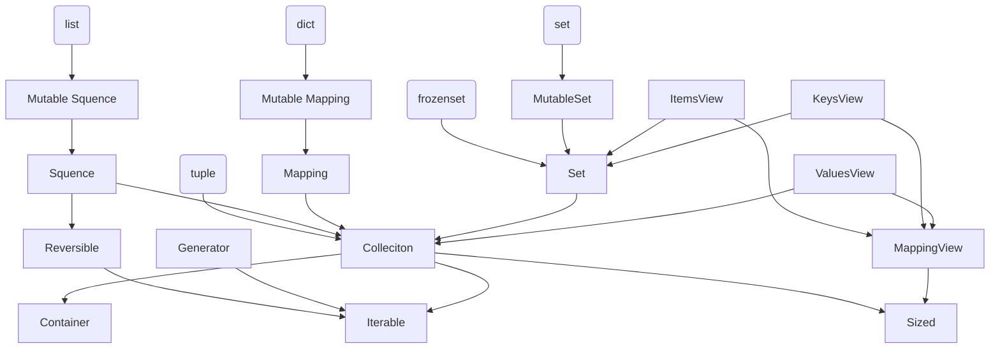

# Getting Started <br> with Statically Typed Programming <br> in Python 3.10

## Peacock (Yoichi Takai), <br> at PyCon US 2022 (2022/05/01)

<!--
Hi, let's start. my talk title is ...
-->

---
layout: intro
---

# Prolog

## Self-Introduction, <br> Table of Contents

---

<div class="text-2xl">

Slides: [slides.p3ac0ck.net/pyconus2022/index.html](https://slides.p3ac0ck.net/pyconus2022/index.html)

Expected: Google Chrome

</div>

<div class="grid grid-cols-[75%,25%] gap-2">

<div class="text-4xl pt-10">

Feel free to Take pictures <twemoji-camera /> <br> or Screenshots and Tweet <twemoji-baby-chick />

Hashtag: **`#pyconus2022`**

</div>

<div></div>

<div class="text-5xl absolute bottom-25 right-25">^ Slides ^</div>

</div>

<!--
Feel free to take pictures screenshots and tweet.

The hashtag is `pyconus2022`
-->

---

# Self-Introduction

<div class="grid grid-cols-[75%,25%] gap-2">

<div>

- Name: Peacock / Yoichi Takai
    - Social media IDs: `peacock0803sz`
        - [Twitter](https://twitter.com/peacock0803sz/), [GitHub](https://github.com/peacock0803sz/), [Facebook](https://www.facebook.com/peacock0803sz)...
    - **Please call me Peacock**

</div>

<div class="ml-2"></div>
</div>

---

- Hobbies & Favourites
    - Playing the Clarinet <twemoji-musical-note />
    - Listening Music (Most is classical)
    - Skiing <twemoji-skier /> , Gadgets...
- 21-years old, This is my first trip abroad <twemoji-airplane />

<!--
Nice to meet you. Hello, PyCon US 2022! Let me introduce myself.
-->

---

# My Works and Communities

- Company: [CMScom](https://cmscom.jp) (Full-time since 2020/06 ~)
    - Web application developer, Flask / Pyramid / Plone etc..
- Experience learning Haskell and TypeScript
- Now, reading "[Types and Programming Languages](https://www.cis.upenn.edu/~bcpierce/tapl/)"
    - As known as "TaPL"
- Member of PloneJP (Plone User's Group in Japan)

<!--
I'm working in CMS communications as a web developer.

I've been learning Haskell and TypeScript, been interested thees for several years.

And more, I involved some communities...
-->

---

## My Activities Related to PyCon JP

- Staff of PyCon JP (since 2020 - ), [2022](https://2022.pycon.jp): Vice-Chair
- Operating Member of [PyCon JP Association](https://www.pycon.jp)
    - Director of [PyCon JP TV](https://tv.pycon.jp) 
    - It's the YouTube live about PyCons and local events held once a month

<!--
Then, I've been a staff of PyCon JP since 2020 and Vice-Chair of this year.

In addition, I'm a director of PyCon JP TV as an Operating member of the PyCon JP Association,
-->

---

# Today's Topics

<v-clicks>

1. Why do I talk about typing?
2. First step of typing, How to write basically 
    - That is what **I most want to say**
3. Generics, User-Defined types (Best practice included)
4. Updates overview recently & Backward compatibility for 3.9 or before
5. Overview of new features on 3.10

</v-clicks>

<!--
this is today's topic.
-->

---

# Why do I talk about Typing?

- It's been 7 years since typing appeared
    - In Python 3.5, at 2015
- Many big PEPs were adopted and updated over the years
- Even now, I think many people **don't know where to start**
    - Because there is little coherent information

<!--
My motivation for talking is to get the word out in a coherent way.
It's been five years (Python 3.5, in 2015) since typing appeared.
-->

---

# What I will NOT talk about

- Developing library with typing
- Configures and options of mypy
- How to use them in CI, ex: GitHub actions, Circle CI and etc...
- History of type hinting
- Implementation of typing, mypy
- Abstract Syntax Tree (AST)

---
layout: section
---

# First step of Typing

## Basic Typing

<!--
OK, Let's take a look at how to actually start Typing!
-->

---

# What makes you happy?

- It knows the type when you reference it in the editor
- It gets angry when I try to give it the wrong one
- The completion will work when accessing the return value of a function using a dot.

<!--
First, let's look at what typing can do for you.
-->

---

## Without the Typing


We don't know the error...


<!--
this is a minimal example.
We don't know the type of return value...
if you try to pass an int to the function, it'll occur an error
-->

---

## With the Typing


and, the editor can tell the argument is wrong

## Editor tells a wrong argument


<!--
How about this case? It looks like s is str, a return value is also str.
-->

---

# In a code review, without Typing...

Boss < What type does this function return?

You < Humm... str or False or None ...?

Boss < THAT'S TOO MANY TYPES!

You < :-(

```py {2|3|4}
def need_new_post():
  if ...: retrun None
  elif ...: retrun False
  else: return post_id  # this is str
```

<!--
and more, there are advantages to code review.
w/o type hint, reviewer, can't know the return type from reading the definition.
As a result, many people may have had this experience.
-->

---

# With Typing...

Boss < It looks like this function may return 3 types... Isn't that too much?

You < I see. That could be a bad design. Let me fix it.

Boss < Sure, please.

```py {1}
def need_new_post() -> None | False | str:
  if ...: retrun None
  elif ...: retrun False
  else: return post_id  # this is str
```

<!--
However, Type hint may make the review process more smooth.
-->

---

# Let's start with function definitions

**Nothing too difficult!** Just write type

- After the arguments, write colon and the type
- Before the colon at the end of the function definition, write an arrow and the type


---

# Using built-in types

- `bool`, `bytes`, `float`, `int`, `str`
    - You don't need to do anything to use them.
- `None`: Used for functions that return nothing.

---

# Escaping from complex type puzzles

- `Any` Can hold instances of any type.
- **It's better not to use it**
    - Import and use from `typing` when necessary.

```py
from typing import Any
very_dangerous_last_resort: Any
```

<!--
now, Let's take a look at the types that can be used in practice.

If you want to escape from complex type puzzles, you can use any. this is the final resort.
-->

---

# (Since 3.9) Generics in standard Collections

- Before 3.9, `from typing import Dict, List` ...
    - Now, it's **depreciated**
- Use `dict`, `frozenset`, `list`, `set`, `tuple`
    - Collections can be written with `[]` for the type inside.
    - ref: [Official Documentation](https://docs.python.org/3.9/whatsnew/3.9.html#type-hinting-generics-in-standard-collections)

<!--
Starts from the upper case are now depreciated <br>
So, it can be used without import!.

for 3.7, 3.8: write `from __future__ import annotaions` (see below)
-->

---

- Module Availabilities in standard library...
    - `collections`: (ex: deque, defaultdict)
    - `collections.abc`: `Iterable`, `Callable`, or other Protocol-Related
    - `re`: Regular Expressions 
    - `contextlib`: Context-Related items

---

# Using types from `collections.abc` differently

- There are many types in `collections.abc`.
- It's better to use a collection with a few methods to increase portability.
    - Ex. `Iterable` is better than `list`.
- It's a good idea to look at the methods used in your functions.

The figure on the next page shows the relationship...

<!--
There are many types in collections.abc.

Although it's unlikely that you will use these in a fine-grained way,

Choosing a collection with as few methods as possible is better to increase portability.

The following figure shows the relationship between collections.abc and a sequence of built-in types defined by method inclusion rather than implementation inheritance.

It is a good idea to look at the methods used in your functions and choose the types on the top side of this diagram as much as possible.
-->

---

# Great method inheritance tree

<div class="absolute inset-15">

<div>



</div>

<div>

</div>

</div>

<style>
.slidev-layout div {
  @apply text-3xl
}
</style>

<!--
The further to the bottom you go, the fewer methods it has. On the top-side, the more methods it has.<br>
For example, if you just want to loop over a sequence of arguments in a function, you can use collections.abc.Iterable. <br>
If you need random access, use Sequence. <br>
If you need to change the value, use a type with Mutable.

Or, if you simply specify the list as the argument type, you will not be able to pass set or dict.<br>
In particular, it is better not to set concrete types (list, tuple, dictionary, set) just because you are familiar with them.<br>
However, I think it is easier to understand using these concrete types, so you may want to first apply these concrete types.<br>
After you confirm that you can use fewer operators and methods, you may want to gradually move to the top side of the types.<br>
-->

---

# The differences between tuple and other Sequences

- `tuple` is fixed up to the length of information
    - Specify the type for the number of elements
        - Or you can mix types, such as `tuple[int, str, float]`.

---

- A sequence, such as a `list`, has the same constraint for all elements
    - Can be used regardless of the length of the Sequence by setting only one.


---
layout: section
---

# Advanced: <br> Generic Types

<!--
Next, there are a few advanced types.
-->

---

# Union (multiple types)

<v-clicks at=1>

`union` can be represented by `|` since 3.10

```py {1}
def square(number: int | float) -> int | float:
  return number ** 2
```

</v-clicks>

<v-clicks at="2">

```py {1,2|3,4|5,6|7,8}
# Nested unions are flattened
(int | str) | float == int | str | float
# Redundant types are removed
int | str | int == int | str
# Orders are ignored
int | str == str | int
# Compatible with typing.Union
int | str == typing.Union[int, str]
```

</v-clicks>

<!--
At first is union, multiple types.

You've probably seen it on Haskell or TypeScript.

The top half code is an Example A function that accepts both integers and floats bottom one is Union objects that can be tested for equality with other union objects.
-->

---

# Optional type

- Shorthand, `Optional[T]` is equivalent to Union with None.
    - Behaves just like Union: `T | None`
- If you use it in a function return value or something, it will propagate, so be careful when you use it.

```py {1|3-}
from typing import Optional

age: Optional[int]
age = 17
age = None # This is also valid
```

---

# Avoid using Optional as much as possible

```py {2|3-5|6}
def get_content() -> str | None:
  r = request.get("https://example.com")
  if r.status_code != 200:
    # Guard section (early return)
    logging.warning("Response: %d", r.status_code)
    return None
  return r.text
```

- When you use the function, you might write another guard and return `None`.
<!-- As a result, we need to write a guard to the previous method, which reduces readability. -->

---

## In this case...

- It would be cleaner to raise a `raise RuntimeError`.
    - The cost of raising exceptions in Python is (relatively) low
        - Little performance impact, unlike Java.
- The lack of null-safe methods in Python is also a factor, Unlike JavaScript.
    - But, if there were such methods, they would be abused.

---

# Callable (callable objects)

```py {1,2|4|6,7|9,10|11,12|13}
from collections.abc import Callable  # since 3.9
from functools import wraps

def validate(func: Callable
) -> Callable[..., Callable]:
  @wraps(func)
  def wrapper(*args, **kw) -> Callable:
    try:
      j = request.json
      if j is None: raise BadRequest
    except BadRequest:
      return abort(400)
    return func(*args, **kw)
  return wrapper
```

<!--
It can be used when writing functions that take a function as an argument, such as decorator functions.
-->

---

# User-defined Generic types

Example: a generic mapping type

```py {2|4|5|7|9-11|12|13}
from typing import TypeVar, Generic
KT, VT = TypeVar("KT"), TypeVar("VT")

class Mapping(Generic[KT, VT]):
  def __getitem__(self, key: KT) -> VT: pass

X, Y = TypeVar("X"), TypeVar("Y")

def lookup_name(  # Using Mapping
  mapping: Mapping[X, Y], key: X, default: Y
) -> Y:
  try: return mapping[key]
  except KeyError: return default
```

<!--
A generic type is typically declared by inheriting from an instantiation of this class with one or more type variables.
-->

---
layout: section
---

# How to use new features in older versions

---

# What is the `__future__` module?

- Using typing new feature in the older versions, write `from __future__ import annotations`
- In addition to typing, it was also used to call 3.x features in 2.x.
    - ex) `print_func`, `unicode_literals` etc ...
- ref: [\_\_future\_\_](https://docs.python.org/3/library/__future__.html), [future statement](https://docs.python.org/3/reference/simple_stmts.html#future)

<!--
Let's talk about dunder future, which has come up many times before.

Modules and methods with two underscores at either end are pronounced dunder.

- It describes when disruptise changes are introduced and become mandatory.
-->

---
layout: section
---

# Recent Update

---

# Recent Python updates

| Ver. | Status   | Release | EoS     | Schedule                                             | Main new feature   |
| ---- | -------- | ------- | ------- | ---------------------------------------------------- | ------------------ |
| 3.11 | Alpha 7  | 2022-10 | 2027-10 | [PEP 619](https://www.python.org/dev/peps/pep-0619/) | Performance tuning |
| 3.10 | Bugfix   | 2021-10 | 2026-10 | [PEP 619](https://www.python.org/dev/peps/pep-0619/) | Pattern Matching   |
| 3.9  | Bugfix   | 2020-10 | 2025-10 | [PEP 596](https://www.python.org/dev/peps/pep-0596/) | Union Operators    |
| 3.8  | Security | 2019-10 | 2024-10 | [PEP 569](https://www.python.org/dev/peps/pep-0569/) | `=` in f-string    |
| 3.7  | Security | 2018-06 | 2023-06 | [PEP 537](https://www.python.org/dev/peps/pep-0537/) | dataclasses        |
| 2.7  | EoL      | 2010-07 | 2020-01 | [PEP 373](https://www.python.org/dev/peps/pep-0373/) | Improving Decimals |

<https://www.python.org/downloads/>

<!--
this is an updated overview recently.

3.7 is ...
-->

---

# New Features on Type Hints in 3.10

- [PEP 604](https://peps.python.org/pep-0604/): New Type Union Operator
- [PEP 612](https://peps.python.org/pep-0612/): Parameter Specification Variables
- [PEP 613](https://peps.python.org/pep-0613/): TypeAlias
- [PEP 647](https://peps.python.org/pep-0647/): User-Defined Type Guards

See Also: <https://docs.python.org/3/whatsnew/3.10.html#new-features-related-to-type-hints>

<!--
The next topic is new features in python3.10, released Nov last year.

There is a difficult feature.

I'm not sure I can explain it well, either.
-->

---

# [PEP 604](https://peps.python.org/pep-0604/): New Type Union Operator `|`

- The union above type can be used as an operator.
- You can also use it when asking `isinstance()`.

```py
int | str == typing.Union[int, str]
# Compatible with typing.Union
```

- `Optional[T]` can also be written as `T | None` using this.

<!-- 
You may have seen this style if you have experience using typescript or other static typed langs.
-->

---

# [PEP 612](https://peps.python.org/pep-0612/): Parameter Specification Variables

## Motivation

Needed a way to represent a function that has the **same arguments as the specified function**

```py {}
from typing import Callable, TypeVar
R = TypeVar("R")

def add_logging(f: Callable[..., R]
) -> Callable[..., R]:
  def inner(*args: object, **kw: object) -> R:
    log_to_database()
    return f(*args, **kwargs)
  return inner
```

---

```py {}
@add_logging
def takes_int_str(x: int, y: str) -> int:
  return x + 7

await takes_int_str(1, "A")
await takes_int_str("B", 2)  # fails at runtime
```

## Approach

- Adding an argument type called `ParameterSpecification` solves the problem.
- It can be used with `Callable` to behave like a generic callable object.

<!-- - You can think of it as an argument version of `TypeVar`. -->

---

## Before

```py {4,5,6|11-}
from typing import Callable, TypeVar
Ps, R = TypeVar("Ps"), TypeVar("R")

def add_logging(f: Callable[Ps, R]
) -> Callable[Ps, R]:
  # args: tuple...?, kwargs: dict...?
  def inner(*args, **kwargs) -> R:
    log_to_database(*args, **kwargs)
    return f(*args, **kwargs)
  return inner

@add_logging
def foo(x: int, y: str) -> int:
  return x + 7
```

---

## After

```py {2|4,5|10-}
from typing import Callable, ParameterSpecification, TypeVar
Ps, R = ParameterSpecification("Ps"), TypeVar("R")

def add_logging(f: Callable[Ps, R]
) -> Callable[Ps, R]:
  def inner(*args: Ps.args, **kwargs: Ps.kwargs) -> R:
    log_to_database(*args, **kwargs)
    return f(*args, **kwargs)
  return inner

@add_logging
def foo(x: int, y: str) -> int: return x + 7
```

---

# [PEP 613](https://peps.python.org/pep-0613/): TypeAlias

## Motivation

- We consider global variables without type hints to be type aliases.
    - This tends to cause problems with forwarding references, scoping, etc.
    - So, we're going to make it possible to explicitly define type aliases.

<!-- - You can still define type aliases implicitly. -->

---

## Approach

- Add a new `typing.TypeAlias`
    - You can write like this `T: TypeAlias = int`
- You can write like: `T: TypeAlias = "int"`
    - Using ForwardReference

---

## Before & After

```py {1,2|4,5|7,8}
x = 1  # untyped global expression
x: int = 1  # typed global expression

x = int  # untyped global expression
x: Type[int] = int  # typed global expression

x: TypeAlias = int  # type alias
x: TypeAlias = “MyClass”  # type alias
```

<!-- - global-level defined variables are considered type aliases -->

---

# [PEP 647](https://peps.python.org/pep-0647/): User-Defined Type Guards

## Motivation

- Type checker tools use a technique called type narrowing to determine the type of information.

```py {3,4|5}
def func(val: Optional[str]):
  # "is None" type guard
  if val is not None: 
    pass # Type of val is narrowed to str
  else: pass  # Type of val is narrowed to None
```

<!-- - In this example, the `if` statement and `is None` are used to automatically narrow down the type. -->

---

However, that will not work as intended if the user function is used.

```py{3|6}
def is_str_list(val: List[object]) -> bool:
  """Determines whether all objects in the list are str"""
  return all(isinstance(x, str) for x in val)

def func1(val: List[object]):
  if is_str_list(val): print(" ".join(val))
# => Error: invalid type
```

- `TypeGuard` allows you to define user-defined type guards via the new typing.

<!-- - By using user-defined type guards, it is easier to get support for type narrowing. -->

---

```py
from typing import TypeGuard

def is_str_list(val: List[object]
) -> TypeGuard[List[str]]:
  return all(isinstance(x, str) for x in val)  
```

And, type narrowing works like next:

---

```py{3|8,9|10}
def is_two_element_tuple(
  val: Tuple[str, ...]
) -> TypeGuard[Tuple[str, str]]:
  return len(val) == 2

OneOrTwoStrs = Union[Tuple[str], Tuple[str, str]]
def func(val: OneOrTwoStrs):
  if is_two_element_tuple(val):
    reveal_type(val)  # Tuple[str, str]
  else: reveal_type(val)   # OneOrTwoStrs
```

<!--
The type checker assumes that the first argument matches the type specified in TypeGuard, if the function returns True. In the above example, data that passes is_str_list() will be treated as List[str].

Note that if this function returns False, type narrowing will not be performed.
In the following example, if is_two_element_tuple(...) block, the type is narrowed to Tuple[str, str] as a result of type narrowing, while in the else block, the type remains unchanged.
-->

---

# New Feature on Type Hints in 3.11

Python 3.11 is focused on performance tuning, <br> but there are also new features in Typing...

<br>

[PEP 673](https://www.python.org/dev/peps/pep-0673): Self Type, It's a way to annotate methods that return an instance of their class

---

# Motivation

Calling `set_scale` on a subclass of `Shape`, the type checker still infers the return type to be `Shape`.

```py{2|6|7,8}
class Circle(Shape):
 def set_radius(self, r: float) -> Circle:
   self.radius = r
   return self

Circle().set_scale(0.5)  # *Shape*, not Circle
Circle().set_scale(0.5).set_radius(2.7)  
# => error: Shape has no attribute "set_radius"
```

---

# Workaround, but it's unintuitive...

```py {2,5,6|11|15}
from typing import TypeVar
TShape = TypeVar("TShape", bound="Shape")

class Shape:
  def set_scale(self: TShape, scale: float
  ) -> TShape:
    self.scale = scale
    return self

class Circle(Shape):
  def set_radius(self, radius: float) -> Circle:
    self.radius = radius
    return self

Circle().set_scale(0.5).set_radius(2.7)  # => Circle
```

---

# `typing.Self` resolves that unintuitively

```py {1|2,3|7,8|12}
from typing import Self
class Shape:
  def set_scale(self, scale: float) -> Self:
    self.scale = scale
    return self

class Circle(Shape):
  def set_radius(self, radius: float) -> Self:
    self.radius = radius
    return self

Circle().set_scale(0.5)  # => It would be *Circle*!
```

<!-- There is no logner to use `typing.TypeVar`! -->

---

# Summary

1. Benefits, starting with `def`, Built-in types
2. Standard collections (since 3.9)
3. Collections, Union, Optional, Callable, User-defined Generics
4. Updates Overview,`__future__` for compatibility

---

5. New features on Python 3.10 and 3.11
    1. 3.10: New Type Union Operator, Parameter Specific Variables, TypeAlias, User-Defined Type Guards
    2. 3.11: Self Type

<!--
First, I talked 
-->

---

# Pages I used for reference (Thanks)

There are links that I referenced. Thank you!

- <https://docs.python.org/3/library/typing.html>
- <https://docs.python.org/3.10/whatsnew/3.10.html>
- <https://docs.python.org/3.11/whatsnew/3.11.html>
- <https://future-architect.github.io/articles/20201223> (ja)
- <https://qiita.com/tk0miya/items/931da13af292060356b9> (ja)
- <https://qiita.com/tk0miya/items/1b093c2eee7668fffb62> (ja)
- <https://qiita.com/tk0miya/items/a27191f5d627601930ed> (ja)

<style>
.slidev-layout.default {
  @apply px-20 py-15 leading-normal;
  font-size: 1.7rem;
  line-height: 1.7rem;
}
</style>

---
layout: fact
---

# Thank you
## See you again next time in Japan!

### Powered by [Slidev](https://sli.dev), using [theme-briks](https://github.com/slidevjs/themes/tree/main/packages/theme-bricks)
